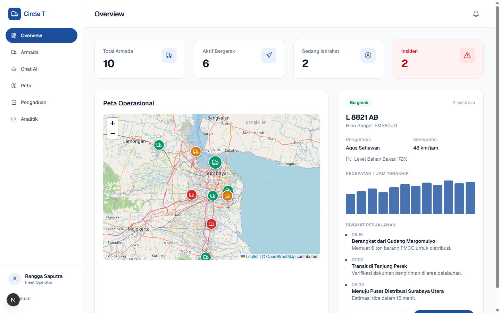
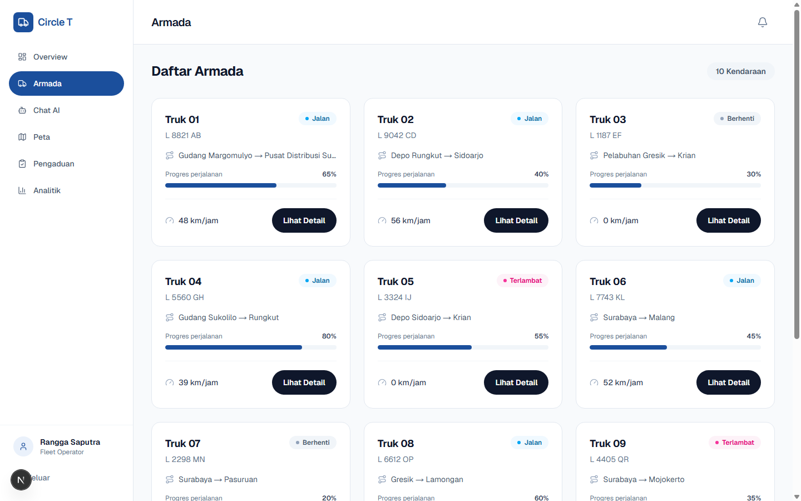
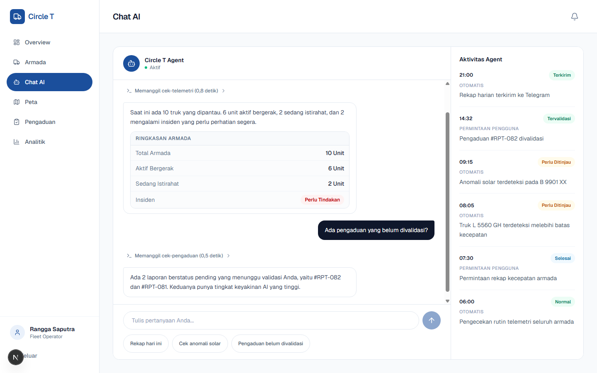
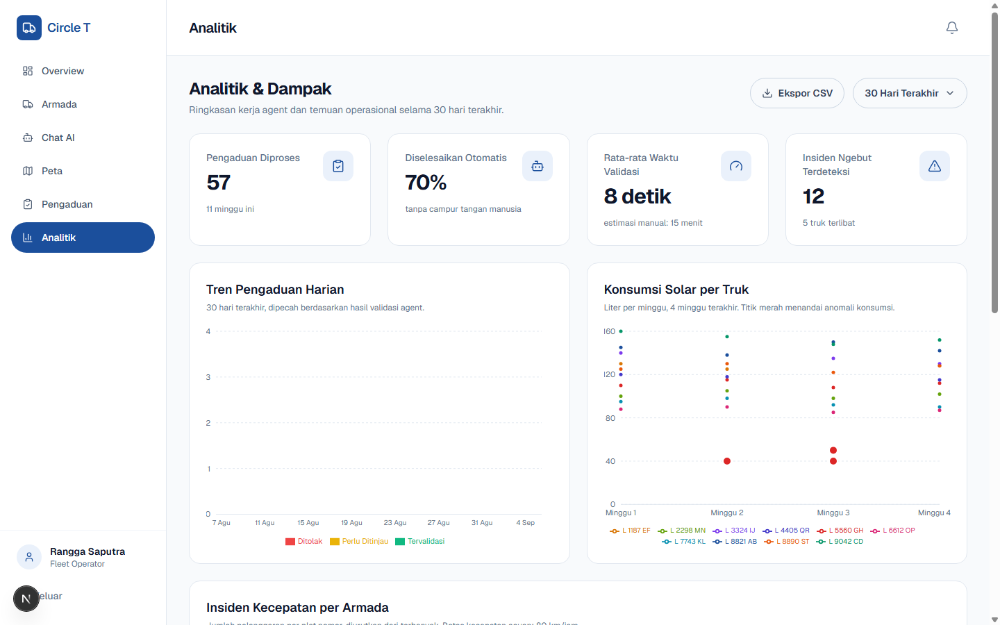
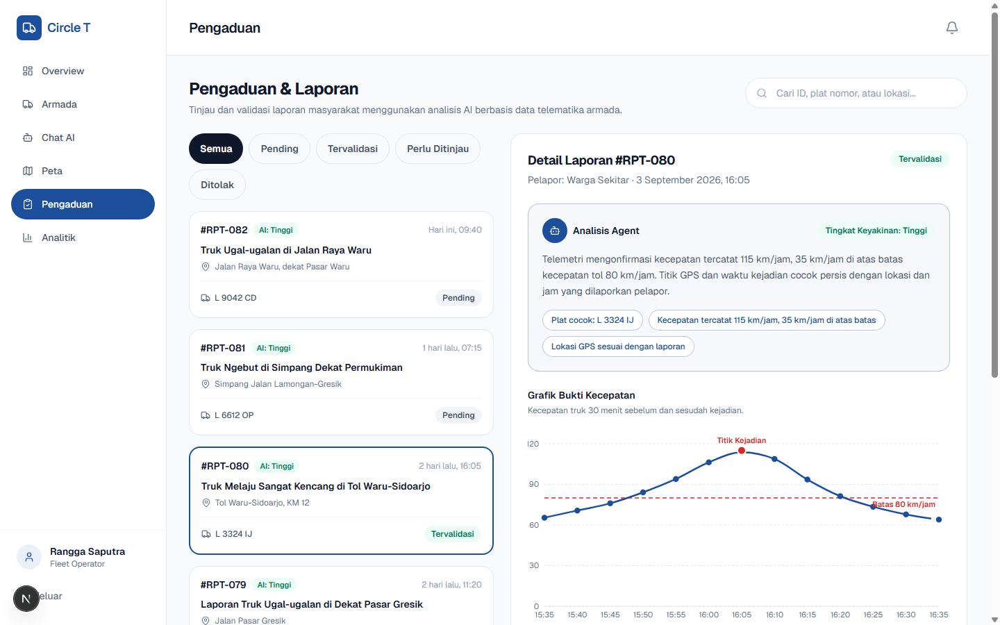
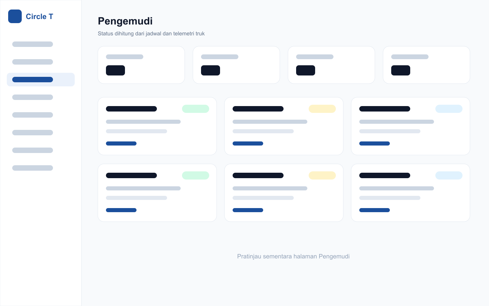
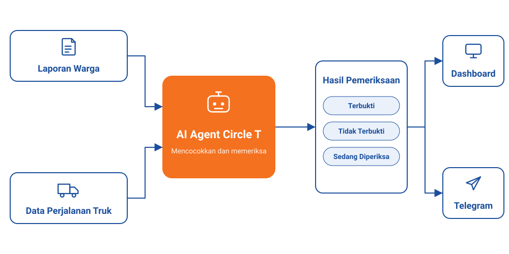

<div align="center">

# TruckCare (Circle T)

Aplikasi web monitoring armada truk: dashboard operator, form pengaduan publik,
chat AI (dengan fallback LLM di VPS), bot Telegram, dan analitik live yang sumber
datanya dari simulasi GPS. Dibuat untuk AI HackFest 2026.

[](https://circletindonesia.vercel.app)
[](https://nextjs.org)
[](https://react.dev)
[](https://tailwindcss.com)
[](https://supabase.com)
[](#lisensi)

<br>

[](https://vercel.com)
[](#)

</div>

## Preview

<table>
  <tr>
    <td></td>
    <td></td>
  </tr>
  <tr>
    <td></td>
    <td></td>
  </tr>
  <tr>
    <td></td>
    <td></td>
  </tr>
</table>

## Fitur

- **Landing publik** (`/`) + **form pengaduan anonim** (`/pengaduan`) dengan
  captcha Cloudflare Turnstile; insert hanya lewat `POST /api/pengaduan`
  (policy insert publik sudah dicabut).
- **Login Supabase Auth** (email/password) + Turnstile di `/login`; sesi
  diverifikasi ulang di edge oleh `proxy.js`.
- **Dashboard** `/dashboard`: Overview, Armada (detail per plat), Jadwal,
  Pengemudi, Peta (Leaflet), Pengaduan, Analitik, Chat AI, Pengaturan.
- **Chat AI**: tool lokal deterministik (jadwal, statistik pengaduan, daftar
  tunggu, anomali solar, status & kondisi truk per plat) dengan fallback
  OpenClaw di VPS. Riwayat persisten per user; system prompt editable di tab
  Pengaturan → AI Agent (tabel `settings`, kunci `agent_prompt`).
- **Bot Telegram**: status armada (kolom Jenis + Plat), `/list`,
  `/detail <plat>`, tombol inline, allowlist `bot_akses`, rate limit 30/menit
  untuk non-owner.
- **Analitik live**: tren aduan, pelanggaran kecepatan (>80), waktu validasi,
  dan konsumsi solar dari tabel `fuel_readings`.
- **Simulasi GPS 15 truk** (Jatim, 6 CDD / 5 Fuso / 4 Trailer) yang memelihara
  `trucks`, `drivers`, `schedules`, dan `fuel_readings` di Supabase.

## Teknologi

| Lapisan | Dipakai |
|---------|---------|
| Framework | Next.js 16 (App Router, JavaScript — tanpa TypeScript) |
| UI | React 19, Tailwind CSS v4, lucide-react, recharts, Leaflet + react-leaflet |
| Backend | Supabase (Postgres + Auth + Storage + RLS) |
| Keamanan | Cloudflare Turnstile, Supabase RLS, allowlist bot |
| Modul VPS | Node.js (`simulasi/`, `telegram/`), Python stdlib (`openclaw/`) |

> **Catatan versi:** repo ini memakai Next.js 16 yang mengubah beberapa konvensi
> (mis. `proxy.js` berperan sebagai middleware, bukan `middleware.js`). Baca
> panduan di `node_modules/next/dist/docs/` sebelum menulis kode — lihat
> `AGENTS.md`.

## Struktur Repo

```
app/            Halaman App Router + route API (app/api/*)
components/     Komponen UI: landing, form, dan shell dashboard
context/        ChatContext (state chat lintas halaman dashboard)
lib/            Klien Supabase, auth, analitik, analisis pengaduan, tool AI agent
supabase/       Migrasi SQL + verify.py (cek RLS end-to-end)
scripts/        Seed & inspeksi data (ESM, membaca .env.local)
simulasi/       Modul VPS: simulasi GPS → Supabase (trucks, drivers, schedules, fuel)
telegram/       Modul VPS: bot Telegram + notifikasi harian
openclaw/       Modul VPS: HTTP server AI (Python stdlib, port 8765)
proxy.js        Middleware: proteksi /dashboard dan API privat
```

Route API utama: `api/agent/chat` (chat AI + tool lokal), `api/pengaduan`,
`api/complaints/[id]` (+ `analyze`), `api/trucks`, `api/drivers`,
`api/schedules` (+ `[id]`, `findings`), `api/analytics`, `api/agent-activity`,
`api/check-plate`, `api/auth/verify-captcha`, dan `api/pengaturan/*`
(openclaw, telegram, agent).

## Menjalankan Lokal

```bash
npm install
cp .env.local.example .env.local   # lalu isi nilainya
npm run dev                        # http://localhost:3000
```

Build produksi:

```bash
npm run build
npm run start
```

Modul VPS (`simulasi/`, `telegram/`) punya `package.json` sendiri: `npm install`
lalu `npm run start` (atau `npm run dev` untuk simulasi). Detail deploy, unit
systemd, dan health check ada di [`VPS-DEPLOY.md`](VPS-DEPLOY.md).

## Environment Variables

Semua variabel untuk aplikasi web ada di `.env.local` (contoh lengkap:
`.env.local.example`).

| Variabel | Cakupan | Fungsi |
|----------|---------|--------|
| `NEXT_PUBLIC_SUPABASE_URL` | publik | URL project Supabase |
| `NEXT_PUBLIC_SUPABASE_ANON_KEY` | publik | Kunci anon (dibatasi RLS) |
| `SUPABASE_SERVICE_ROLE_KEY` | server only | Akses penuh; juga dipakai `scripts/*` |
| `OPENCLAW_ENDPOINT` | server only | Alamat HTTP server OpenClaw di VPS |
| `OPENCLAW_API_KEY` | server only | Harus sama dengan `OPENCLAW_API_KEY` di VPS; kosong = tanpa auth |
| `TELEGRAM_BOT_TOKEN` | server only | Cek status bot (`getMe`) dan pesan uji dari halaman Pengaturan |
| `TELEGRAM_CHAT_ID` | server only | Tujuan default pesan uji |
| `NEXT_PUBLIC_TURNSTILE_SITE_KEY` | publik | Site key Turnstile |
| `TURNSTILE_SECRET` | server only | Verifikasi token captcha |
| `TURNSTILE_HOSTNAMES` | server only | Hostname yang boleh submit (koma-terpisah); di produksi **jangan** isi `localhost` |

Di Vercel Production, setiap kali menambah env wajib redeploy.

## Database (Supabase)

SQL ada di `supabase/` dan dijalankan manual (SQL editor atau MCP Supabase),
bukan otomatis. Urutan yang sudah dipakai:

1. Basis: `schema.sql`, `rls.sql`, `storage.sql`, `seed.sql`,
   `seed-dummy-15-30.sql`, `migrasi-plat-jatim.sql`, `trucks-jenis.sql`*,
   `cek-truk-nonaktif.sql`, `cek-insiden.sql`, `cek-rentang-data.sql`.
2. Pengaduan: `cabut-insert-publik.sql`, `pengaduan-keputusan.sql`,
   `pengaduan-catatan-array.sql`, `pengaduan-alasan-catatan.sql`,
   `pengaduan-analisis.sql`, `pengaduan-diputuskan-oleh.sql`,
   `pengaduan-luar-armada.sql`.
3. Jadwal, BBM, performa: `schedules.sql`, `seed-schedules-demo.sql`,
   `fuel-readings.sql`, `drivers-truck-id.sql`, `indeks-performa.sql`,
   `analitik-agregat.sql`.
4. AI & bot: `agent-settings.sql`, `agent-runs.sql`, `chat-logs-user.sql`,
   `bot-akses.sql`.

\* `trucks-jenis.sql` **jangan dijalankan tanpa koordinasi**: file itu membuat
20 truk, sedangkan simulasi hanya punya 15 rute.

Helper data (membaca `.env.local`, butuh `SUPABASE_SERVICE_ROLE_KEY`):

```bash
node scripts/seed.js            # seed dasar
node scripts/seed-data.js       # seed data demo
node scripts/verify-fleet.js    # cek konsistensi armada
node scripts/inspect-data.js    # inspeksi tabel
node scripts/clean-orphans.js   # bersihkan baris orphan
node scripts/clean-test-data.js # hapus data uji
```

Verifikasi RLS + tulis/hapus end-to-end tanpa framework:

```bash
SUPABASE_URL=... SUPABASE_ANON_KEY=... SUPABASE_SERVICE_ROLE_KEY=... python3 supabase/verify.py
```

## Alur Data

<p align="center">
  
</p>

## Catatan Operasional

- Cache Turbopack (`rm -rf .next`) bisa menyembunyikan error build — kalau
  build/route hasilnya mencurigakan, hapus `.next` lalu build ulang.
- Halaman dynamic bisa lolos build tapi 500 saat dibuka; uji halaman setelah
  merge.
- PostgREST memotong hasil di 1000 baris (`max-rows`) tanpa peringatan —
  paginasi untuk data besar.
- Turnstile tidak render di browser otomatis/headless (wajar); di browser user
  normal akan tampil.
- Repo dipakai lebih dari satu sesi kerja bersamaan: commit cepat, jangan reset
  branch orang lain, dan jangan ambil alih branch `feat/*` yang bukan milikmu.

## Dokumentasi Lain

- [`HANDOFF.md`](HANDOFF.md) — status terkini, riwayat PR, dan rencana lanjutan.
- [`VPS-DEPLOY.md`](VPS-DEPLOY.md) — server VPS, unit systemd, health check,
  troubleshooting.
- [`AGENTS.md`](AGENTS.md) — catatan wajib untuk agen/AI yang menulis kode di
  repo ini.

## Acknowledgments

- [Next.js](https://nextjs.org) — framework React
- [Supabase](https://supabase.com) — database, auth, storage
- [Tailwind CSS](https://tailwindcss.com) — utility-first CSS
- [Leaflet](https://leafletjs.com) — peta interaktif
- [Recharts](https://recharts.org) — grafik React
- [Lucide](https://lucide.dev) — ikon
- [Cloudflare Turnstile](https://www.cloudflare.com/products/turnstile/) — captcha gratis
- [Vercel](https://vercel.com) — hosting & deploy

## Lisensi

Belum ada file `LICENSE`; project ini privat (`"private": true`) untuk keperluan
lomba.
